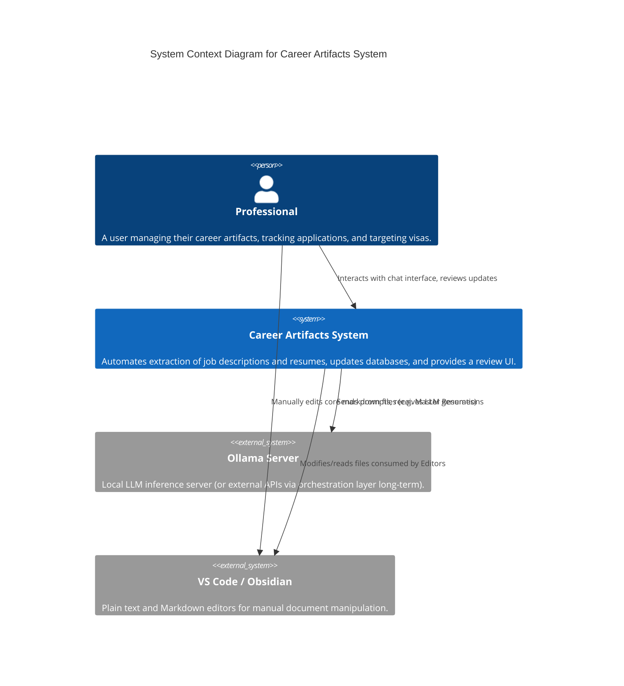
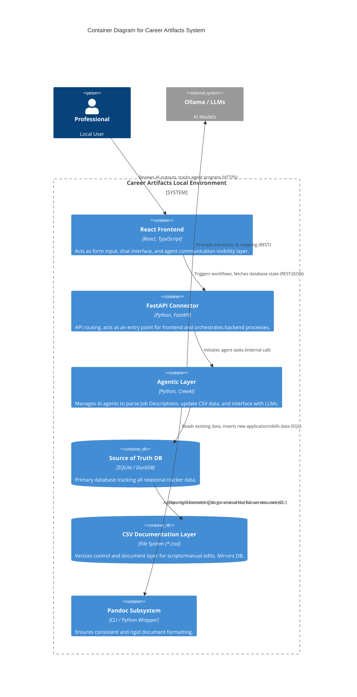
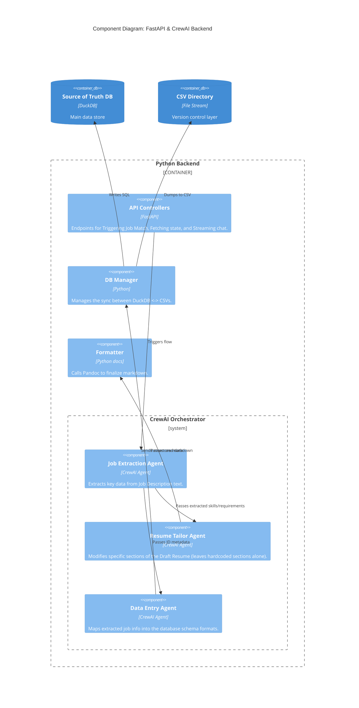

# System Architecture

This document describes the software architecture of the Career Artifacts System, adhering to the C4 model for visualizing software architecture.

## 1. System Context Diagram (Level 1)

This diagram shows the Career Artifacts System in the context of its user and the external tools it interacts with.

---

## 2. Container Diagram (Level 2)

This diagram breaks down the Career Artifacts System into its major executables/containers.

---

## 3. Component Diagram (Level 3: Backend Logic)

Below is a breakdown of the Agentic flow mediated by FastAPI and CrewAI. 

---

## 4. Architectural Principles

1. **Database as Source of Truth, CSV as Version Control:** 
   The application directly queried for analytics or data integrity checks is SQLite or DuckDB. The CSV files are treated as representations of this database, ensuring clean version control through Git.
2. **Loosely Coupled UI:** 
   FastAPI and React are used for the review layer and visibility. They are NOT required to edit `.md` documents. VS Code and Obsidian exclusively manage `.md` authoring.
3. **Agent Orchestration Abstraction:** 
   CrewAI handles agent logic to safely separate the reasoning layer from the API layer. Moving away from local Ollama to a commercial cloud API only requires swapping the LLM tool within CrewAI.
4. **Formatting Consistency via Pandoc:** 
   LLMs have poor formatting adherence. Pandoc will enforce strict UK ATS-friendly styles onto the markdown outputs generated by the Resume Agent.
